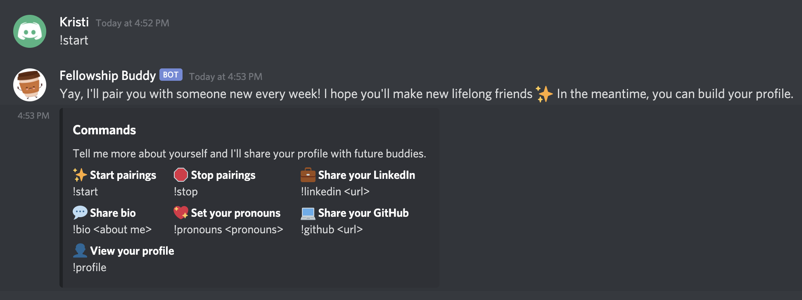
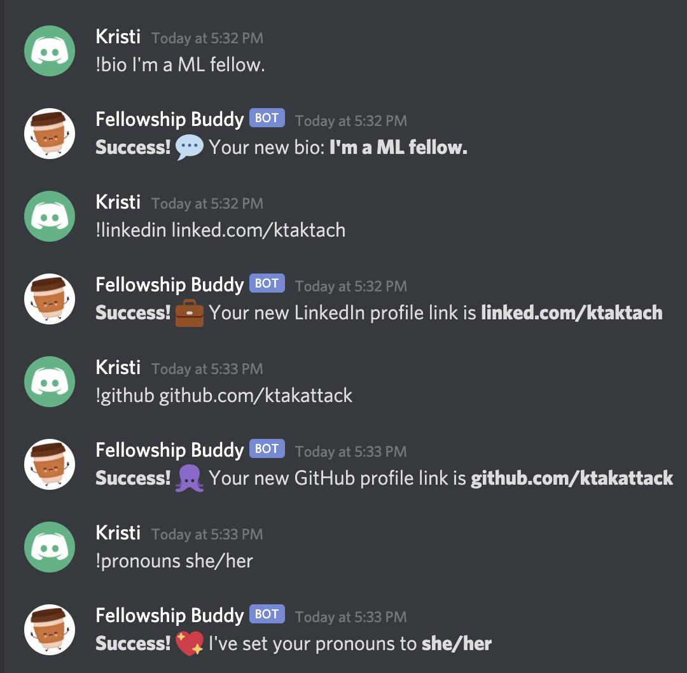
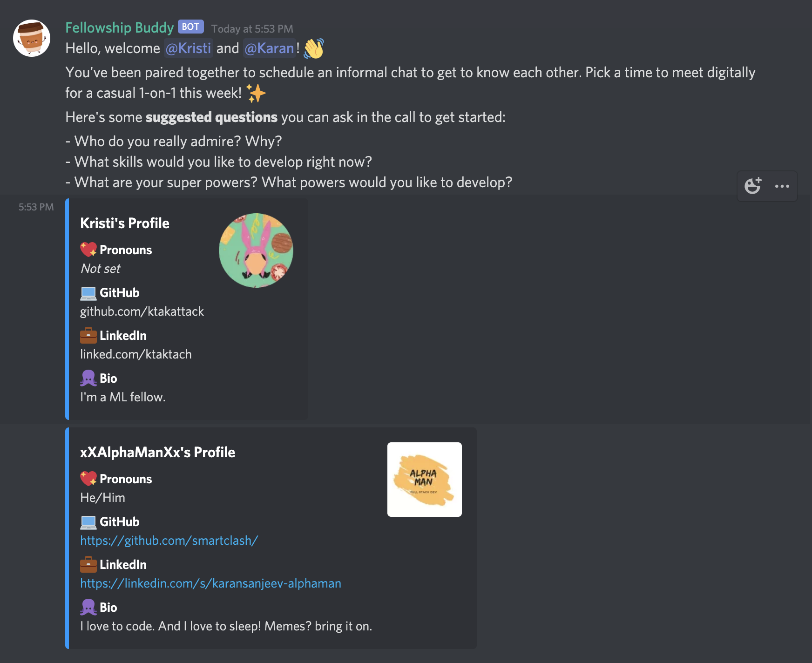

# Discord Coffee Buddy - MLH Halfway Hackathon

This is a Discord bot that facilitates informal 1:1 coffee chats by randomly choosing between fellows, mentors, and maintainers who opt-in. ☕ The theme for this hack addresses: "Community Building – Create a project that helps foster connections between fellows, mentors, and maintainers.". In a remote environment, it's as important as ever to meet people and make new friends!

## About

This is a [Node.js](https://nodejs.org/en/) project that uses the [discord.js](https://discord.js.org/) library to communicate with the Discord API. There are several commands users can interact with to start getting paired with somebody else from the organization. To get started using the bot, users need to opt-in by using the start command. After activating the service, users can build a profile consisting of social links (LinkedIn, GitHub) which will be shared with the match to facilitate the conversation. This information is saved on a database (more information on how to connect the database will be shared later) to which we connect with [Sequelize](https://sequelize.org/).

## Features

Coffee Buddy was designed to ensure the best experience 💖 Here are some of its most notable features:

-   Automated no-human-needed pairings ✨
-   Human-friendly responses which foster an inclusive community 🌈 (users can set pronouns)
-   User profiles that showcase pronouns LinkedIn, GitHub, bio links to facilitate the conversation ☕️
-   Easy integration with an external database (any!) 💁🏼‍♂️

## Usage

### Setting up environment variables

This project uses [dotenv](https://github.com/motdotla/dotenv) to load environment variables from `.env` file. You’ll need to create a `.env` file and declare the following keys:

-   `BOT_TOKEN`: get your Discord bot token in the Discord Developer Portal.
-   `GUILD_ID`: the ID of your Discord guild.
-   `PREFIX`: specify this variable if you’d like to set up a different prefix for the commands (default is currently `!`).
-   `DB_NAME`: database name
-   `DB_USERNAME`: database username
-   `DB_PASSWORD`: database username password
-   `DB_HOST`: URL where the database is hosted

### Setting up the database

This project uses MySQL as the database and [sequelize](https://github.com/sequelize/sequelize) as an ORM. The `migrations` folder contains all the migrations you need to run to get your database in the right state.

After installing the dependencies and ensuring MySQL is running, you would need to run the migrations. Migrations are managed using [sequelize-cli](https://github.com/sequelize/cli).

Run the command `npx sequelize-cli db:migrate`. This applies the migrations within the migrations folder and creates all the necessary tables in the `DB_NAME` provided.

### Starting the application

#### Watch Mode

`npm run watch` starts the application and enables hot reloding using [nodemon](https://github.com/remy/nodemon).

`npm run start` starts a application as a regular node application.

### User Flow
Welcome to Fellowship Buddy!

Ask for help anytime.

Set up your profile. These answers are saved in a database for easy retrieval.

When two users are paired together, a private hidden channel is created and the users' profiles are shared to facilitate the conversation.

### Contributions

Contributions are welcome. Just create a pull request and someone would attend to it.